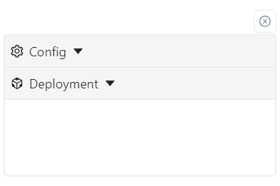
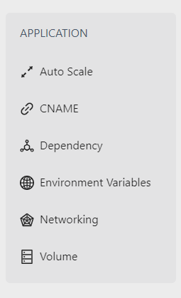
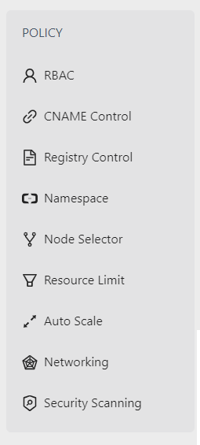

# Frontend Structure

## Overview

The frontend is designed to be data-driven. Functions are written to generate UI components based on JSON objects. These objects can be found in [constants.js](/frontend/src/utils/constants.js)

## Data Objects

Below is the explaination for each object inside [constants.js](/frontend/src/utils/constants.js) :

#### ROUTER_PATHS

Contains navigation paths for `react-router`

#### REQUEST_URLS

URLs for api requests

#### LOCAL_STORAGE

Names for all local storage variables

#### APP_BLOCK_TYPES

Different types of `app-blocks` that can be created.
An `app-block` is the draggable container inside of which different components can be placed.

> appDeployment : App block used for deployments

> framework : App block used for policies

#### FORM_ELEMENTS

Different form elements that can be created

#### NESTED_TYPES

During generation, some components have fields that are nested within eachother. These type describe what kind of nesting should the function perform.

> conditional : fields that are only visible if a certian value in the component is selected

> collapsable : fields that are collapsed and need to be expanded by clicking on their parent

#### PROVIDERS

A list of all the providers for generating and saving

#### DND_TYPES

Different types used for `dnd-kit`

> block : Draggable containers inside which other components can be placed

> appComponent : Components used for deployments

> policyComponent : Components used for policies

> workArea: Droppable container inside which blocks exist

#### COMPONENT_DEFINITIONS

This object consists of child objects which completely define each component. Here are the fields that define a component :

> name : Name of the component. Used while rendering the UI

> payloadName : Name under which the component passed to the payload for requests

> componentType : Defines what type of component it is

> multiple : Can an appBlock have more than one of this component

> mandatory : Is this component mandatory. If yes, then the component get added to the appBlock on creation and can not be removed

> formSchema : Describes how the form for this component is rendered. More info below

> payloadDefinition : Object that contains fields which are passed to the payload generation function

##### formSchema :

The object is structured so that the `key` of the child object is the name which is used for rendering the label/name for the element.

Inside the child object we can have :

> elementType : Type of element that is to be rendered in the form

> required : Whether this field is required. If yes, the border for this field will turn red if its left empty

> payloadName : Name under which the input value of this field is passed to the payload

> type : Define what kind of input to render

> nestedType : Define what kind of nested children to render

> nestedFields : Fields that are nested inside this field. They follow the exact same structure as normal fields.

## Definitions

`definitions` is an object, accessible globally via the `useContext` hook. It defines appBlocks which contain components and the values of the input fields of the components.

Each appBlock is identified by a uuid as its key

Each appBlock is treated as an object and the components placed inside an appBlock via the UI become nested inside this object.

Similarlay, removing an appBlock or component from the UI removes that appBlock or component from the `definitions` object.

During runtime, the app itterates over the definitions object and renders the UI accordingly

# Payload

`payload` is another globally accessible object which defines the fields that are to be passed to the generation, save and update endpoints.

This `payload` is constructed based on the `definitions` object. We itterate over the `definitions` object, get each appBlock including its component fields, and pass those fields to the `payload` object. This is where the `payloadDefinition` object is used.
